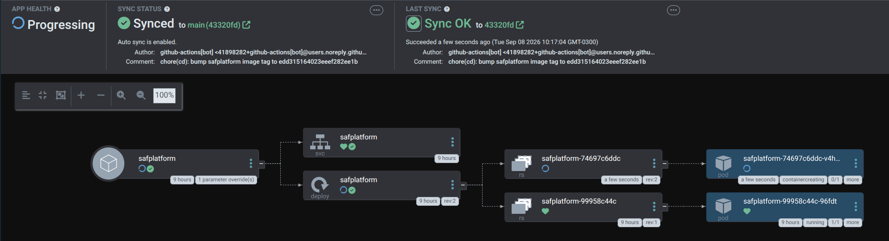
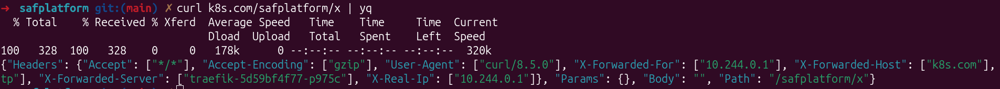

# safplatform

Minimal Go HTTP service that echoes back every request it receives. Any path and any method return a JSON payload with the request headers, query params, body and path.

## Stack

| Item | Value |
| --- | --- |
| Language | Go 1.27 |
| Router | `github.com/go-chi/chi/v5` |
| Runtime image | `gcr.io/distroless/static-debian12:nonroot` |
| Delivery | GitHub Actions + ArgoCD (GitOps) |

## Design decisions

- **chi** instead of the standard `net/http` mux — keeps routing and middleware code simpler and more readable.
- **ArgoCD** for delivery — adopts the market-standard GitOps flow.

## API

`ANY /*` → `200 application/json`

```json
{
  "Headers": { "Accept": ["*/*"] },
  "Params": { "q": ["1"] },
  "Body": "",
  "Path": "/anything"
}
```

- `Body` is returned as raw JSON when the payload is valid JSON, otherwise as a string.
- `PORT` env var overrides the default port `8080`.
- Graceful shutdown on `SIGINT`/`SIGTERM` (10s grace).

## Local development

```bash
go run .          # start on :8080
scripts/test.sh   # go vet + go test
```

Recommended: open the repo in VS Code and reopen in the devcontainer.

## Folder architecture

| Path | Purpose | Improvement points |
| --- | --- | --- |
| `.devcontainer` | Setup to build the app locally without installing dependencies on the host, and to guarantee IntelliSense in VS Code. | — |
| `.github` | CI/CD workflows. | Use reusable workflows or actions to be created later in the [jasondavindev/open-idp](https://github.com/jasondavindev/open-idp) repo. |
| `.idp` | Files applied into Kubernetes by ArgoCD. More details about the flow in the [jasondavindev/open-idp](https://github.com/jasondavindev/open-idp) repo. | Replace with Helm charts to be created later in the [jasondavindev/open-idp](https://github.com/jasondavindev/open-idp) repo. |
| `scripts` | Scripts used by the CI/CD workflow. | Use reusable workflows that already contain the script inside. |
| `Dockerfile` | Production workload image — used by the build job in the CI/CD pipeline. | — |
| `main.go` | Main application file containing the code. | — |

## CI/CD

Triggered on push to `main` ([.github/workflows/cicd.yaml](.github/workflows/cicd.yaml)):

1. **test** — runs `scripts/test.sh` (`go vet` + `go test`) inside `golang:1.27`.
2. **build** — `scripts/ci.sh` builds with buildx (registry cache) and pushes `<registry>/safplatform:<commit-sha>`.
3. **deploy** — `scripts/cd.sh` bumps `.image.tag` in [.idp/safplatform/values.yaml](.idp/safplatform/values.yaml) to that SHA and commits it back to this repository; ArgoCD syncs the new tag and rolls out a new version of the Deployment in Kubernetes.

Required secrets: `CONTAINER_REGISTRY`, `REPO_USER`, `REPO_PASSWORD`.

Improvement points:

- Instead of committing to this repository, the deploy job should commit to [jasondavindev/open-idp](https://github.com/jasondavindev/open-idp) — the central catalog of all apps installed in the cluster.
- Replace the shell scripts with reusable workflows that already contain them.

## Screenshots

ArgoCD syncing the tag committed by the deploy job and rolling out the new ReplicaSet:



Request to the app running in the cluster, behind Traefik:


